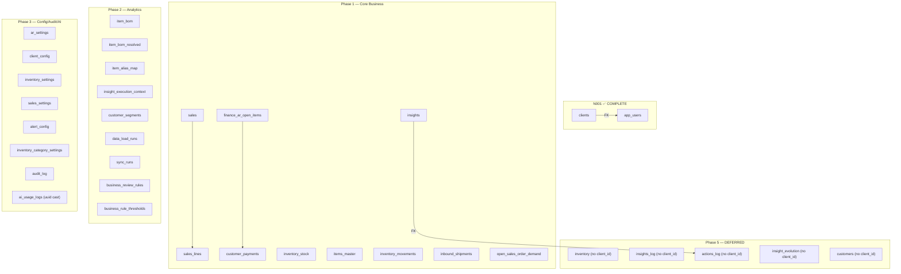

# N002 Execution Strategy

**Task:** N002 — Domain Table RLS Policies
**Wave:** 0C (Planning) → 0D (Execution)
**Date:** 2026-07-10
**Status:** READY FOR EXECUTION — Pending user approval per phase
**Dependencies:** N001 ✅ COMPLETE | T001 ✅ | T002 ✅ | T005 ✅

---

## 1. Table Classification Summary

| Category | Count | Has client_id | Strategy | Policies |
|:--------:|:-----:|:------------:|---------|:--------:|
| **A** — Business tables | 27 | ✅ YES | `client_id` = JWT policy | 108 |
| **B** — Schema evolution needed | 17 | ❌ NO | Deferred (ALTER TABLE first) | ~68 |
| **C** — Reference/shared | 5 | ❌ NO | Exempt / public-read | 0–5 |
| **D** — System/internal/backup | 47 | Mixed | No policies (backend-only) | 0 |
| **Total** | **96** | | | **~181** |

Full classification: [n002_table_classification.md](file:///c:/Users/dario/erp-intelligence-foundation/docs/agents/platform/product-intelligence/n002_table_classification.md)

---

## 2. Security Model

### Tenant Isolation Mechanism

```
JWT Token → request.jwt.claims → client_id claim
                                       ↓
Policy: USING (client_id = current_setting('request.jwt.claims', true)::jsonb ->> 'client_id')
```

### Role Behavior

| Role | rolbypassrls | Effect |
|------|:----------:|--------|
| `postgres` | ✅ true | Bypasses ALL policies. Backend is unaffected. |
| `service_role` | ✅ true | Bypasses ALL policies. |
| `authenticated` | ❌ false | Policies ENFORCE. Tenant isolation active. |
| `anon` | ❌ false | Policies ENFORCE. Default deny (no policies = no access). |

### Policy Naming Convention
```
n002_<tablename>_<operation>_own_tenant
```
Examples: `n002_sales_select_own_tenant`, `n002_items_master_update_own_tenant`

### Exception: `ai_usage_logs`
```sql
-- client_id is uuid, not text — requires explicit cast
USING (client_id::text = current_setting('request.jwt.claims', true)::jsonb ->> 'client_id')
```

---

## 3. Execution Phases

| Phase | Scope | Tables | Policies | Duration | Approval |
|:-----:|-------|:------:|:--------:|:--------:|:--------:|
| **1** | Core Business | 10 | 40 | 30 min | Required |
| **2** | Analytics & Intelligence | 9 | 36 | 20 min | Required |
| **3** | Config, Audit & AI | 8 | 32 | 15 min | Required |
| **4** | Reference & System | 52 | 0 | 5 min | Informational |
| **5** | Schema Evolution | 17 | ~68 | 2+ hrs | Separate wave |

Phases 1–3 can be executed in a single session or individually.
Phase 4 is documentation-only.
Phase 5 is a separate engineering task requiring schema changes.

Full plan: [n002_execution_plan.md](file:///c:/Users/dario/erp-intelligence-foundation/docs/agents/platform/product-intelligence/n002_execution_plan.md)

---

## 4. Dependency Graph



### Function Dependencies

| Function | Reads From (Phase) | Writes To (Phase) |
|----------|-------------------|------------------|
| `refresh_stg_sales_clean` | raw_sales (D) | stg_sales_clean (D) |
| `refresh_stg_sales_lines_clean` | raw_sales_lines (D), stg_sales_clean (D) | stg_sales_lines_clean (D) |
| `refresh_stg_ar_open_items_clean` | raw_ar_open_items (D) | stg_ar_open_items_clean (D) |
| `refresh_finance_snapshots` | views | finance_ar_snapshot_daily (B5), finance_customer_risk_snapshot (B5) |
| `refresh_inventory_supply_intelligence` | views | inventory_bom_capacity_current (B5), inventory_supply_semantic_current (B5) |
| `generate_insights_snapshot` | views, insights_log (B5) | insights_log (B5), insight_evolution (B5), actions_log (B5) |
| `refresh_open_sales_order_demand` | raw_open_sales_orders (D) | open_sales_order_demand (Phase 1) |

**Key insight:** Functions that write to Category D tables (raw/staging) are unaffected because those tables have no policies. Functions that write to Category B tables (Phase 5) won't be affected until Phase 5 is executed.

---

## 5. Migration Order

```
Pre-check: Verify N001 policies still intact (8 policies on clients + app_users)
     ↓
Phase 1: Core Business Tables (10 tables, 40 policies)
     ↓ validate
Phase 2: Analytics & Intelligence (9 tables, 36 policies)
     ↓ validate
Phase 3: Config, Audit & AI (8 tables, 32 policies)
     ↓ validate
Phase 4: Document exemptions for Category C/D (0 policies)
     ↓
CHECKPOINT: 108 new policies + 8 N001 policies = 116 total
     ↓
Phase 5: Schema Evolution (SEPARATE APPROVAL REQUIRED)
```

---

## 6. Validation Checkpoints

### After Each Phase

| Check | Query | Expected |
|-------|-------|----------|
| Policy count | `SELECT COUNT(*) FROM pg_policies WHERE policyname LIKE 'n002_%'` | Phase 1: 40, Phase 2: 76, Phase 3: 108 |
| All PERMISSIVE | `SELECT DISTINCT permissive FROM pg_policies WHERE policyname LIKE 'n002_%'` | `PERMISSIVE` |
| Target role | `SELECT DISTINCT roles FROM pg_policies WHERE policyname LIKE 'n002_%'` | `{authenticated}` |
| postgres reads data | COUNT(*) on all affected tables | Same as pre-execution counts |
| No function errors | Call `refresh_finance_snapshots(CURRENT_DATE)` | Returns void, no error |

### Final Validation (after Phase 3)

| Check | Query | Expected |
|-------|-------|----------|
| Total policies in DB | `SELECT COUNT(*) FROM pg_policies WHERE schemaname = 'public'` | 116 (8 N001 + 108 N002) |
| Backend login works | JOIN app_users ⋈ clients | 1 row |
| Sales query works | `SELECT COUNT(*) FROM sales s JOIN sales_lines sl ON ...` | >0 |
| Finance query works | `SELECT COUNT(*) FROM finance_ar_open_items` | 1061 |
| AI insert works | `SELECT COUNT(*) FROM ai_usage_logs` | 21 |

---

## 7. Rollback Strategy

### Per-Phase Rollback
Each phase has its own `DROP POLICY IF EXISTS` block. Rollback is:
- **Instant** (< 1 second per phase)
- **Metadata-only** (no data changes)
- **Safe to run while connections are active**
- **Idempotent** (`IF EXISTS` prevents errors)

### Full N002 Rollback
```sql
-- Nuclear rollback: DROP ALL N002 policies
DELETE FROM pg_policies WHERE policyname LIKE 'n002_%';
-- Note: This is NOT valid SQL. Use individual DROP POLICY statements.
-- Full rollback scripts will be generated as sql/n002_phase1_rollback.sql, etc.
```

### Rollback Does NOT Affect
- N001 policies (named `n001_*`)
- RLS enabled state (rowsecurity stays true)
- Table data
- Functions, views, triggers
- Backend application

---

## 8. Success Criteria

| # | Criterion | Verification Method |
|---|-----------|-------------------|
| 1 | 108 policies created across 27 Category A tables | pg_policies count |
| 2 | All policies are PERMISSIVE with role = authenticated | pg_policies query |
| 3 | Backend (postgres role) reads all data unaffected | COUNT queries |
| 4 | Backend login flow works | JOIN query |
| 5 | Backend route queries return correct results | Reproduce key queries |
| 6 | No function execution errors | Call refresh_finance_snapshots |
| 7 | Zero application downtime | Architectural guarantee (bypassrls) |
| 8 | Rollback SQL files exist before execution | File system check |
| 9 | Execution report produced | n002_execution_report.md created |
| 10 | project_state.md updated | File updated with N002 completion |

---

## 9. Risk Matrix

| # | Risk | Phase | Severity | Probability | Impact | Mitigation |
|---|------|:-----:|:--------:|:-----------:|--------|-----------|
| R1 | Backend unaffected by any policy | 1-3 | ✅ NONE | 0% | None | `rolbypassrls: true` |
| R2 | Policy syntax error on 1+ tables | 1-3 | 🟢 LOW | 5% | SDK blocked | Rollback < 1s |
| R3 | `ai_usage_logs` uuid cast | 3 | 🟡 MED | 10% | 1 table | Test cast first |
| R4 | refresh_* functions fail (Phase 5 only) | 5 | 🔴 HIGH | 30% | ETL breaks | Update functions first |
| R5 | View behavior change for SDK | 1-3 | 🟢 LOW | 100% | Expected | No SDK clients exist |
| R6 | rls_auto_enable event trigger | ALL | 🟢 LOW | 5% | New tables get RLS | Doesn't create policies |
| R7 | Missing `mv_kpi_finance_dso_action_list` | N/A | 🟡 MED | 100% | Finance DSO endpoint errors | Not N002-related; separate bug |

---

*Strategy document generated by Antigravity — Engineering Execution Agent*
